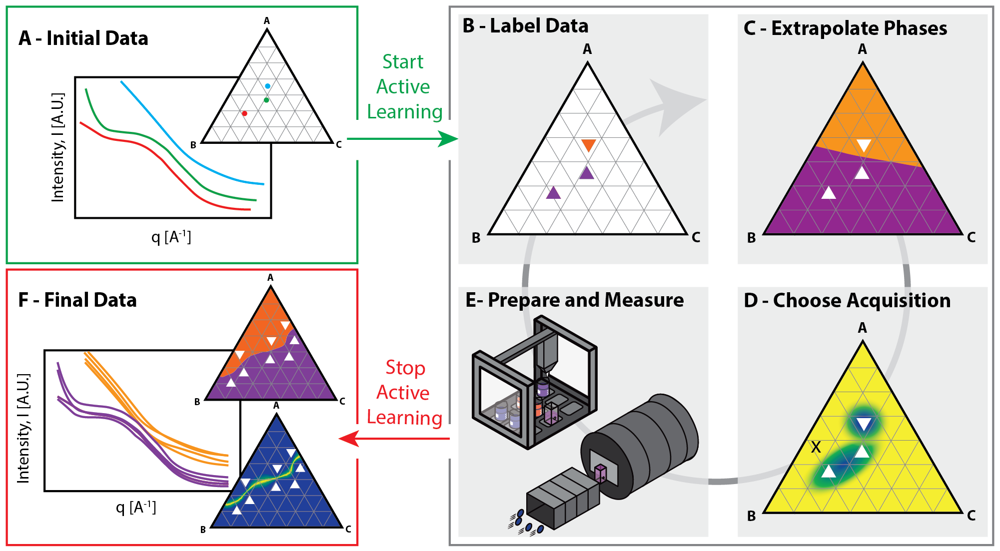

.. AFL-agent documentation master file, created by
   sphinx-quickstart on Tue May 28 13:58:39 2024.
   You can adapt this file completely to your liking, but it should at least
   contain the root `toctree` directive.

AFL-agent 
==========

Welcome to AFL-agent, the software package for the Autonomous Formulation Lab
(AFL).  The AFL is dedicated to accelerating the discovery and optimization of
soft materials through innovative integration of robotic automation and
AI/ML-driven experimentation.

This package provides the AI agent infrastructure that enables researchers to
build sophisticated decision pipelines.  These pipelines can automatically
process measurement data and make intelligent decisions about the next optimal
sample to synthesize or analyze.  By combining automated experimentation with
machine learning, AFL-agent helps streamline the materials discovery process and
reduce the time from concept to breakthrough.

Key capabilities include:

- Simple, modular, context-based approach to building decision pipelines
- xArray based data model for storing and processing experimental data
- Integration with common AI/ML frameworks (e.g., scikit-learn, , TensorFlow, PyTorch)
- Visualization tools for inspecting and debugging decision pipelines
- Pipeline serialization and loading

Documentation Sections
-------------------

.. toctree::
   :maxdepth: 2
   :caption: User Guide

   tutorials/index
   how-to/index

.. toctree::
   :maxdepth: 2
   :caption: API Reference

   reference/double_agent
   reference/deprecated_agent

.. toctree::
   :maxdepth: 1
   :caption: Development

   contributing
   changelog

Indices and Search
================

* :ref:`genindex`
* :ref:`modindex`
* :ref:`search`

.. autosummary::
   :toctree: _autosummary
   :template: custom-module-template.rst
   :recursive:

   AFL.agent
